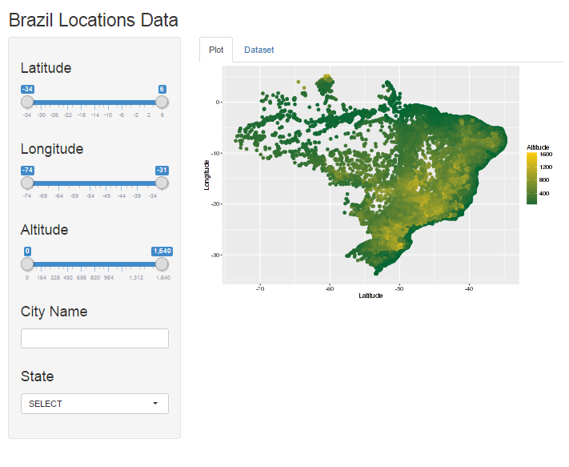

## Application overview

Brazil is the world's fifth-largest country, both by geographical area and by population. 
Lots of data about the country are available in [Brazilian Institute of Geography and Statistics](http://www.ibge.gov.br/english/default.php)

The current presentation aims to discuss about the Shiny Web Application (R Based) made to deal with geolocalization data from Brazil cities.

### URLs
The Shiny Application is in [https://fabio-mat-br.shinyapps.io/ddp-app/](https://fabio-mat-br.shinyapps.io/ddp-app/)

The GitHub repository is [https://github.com/fabio-mat-br/coursera-ddp/tree/master](https://github.com/fabio-mat-br/coursera-ddp/tree/master)

The presentation is in [http://fabio-mat-br.github.io/coursera-ddp/](http://fabio-mat-br.github.io/coursera-ddp/)

--- .class #slide-3 

## The file ```server.R```

The project needs a data file form IBGE's FTP, that will be downloaded when you run the application.

We extract relevant information to our interactive data exploration:

```r
df_localidades <- data.frame(data$LONG, data$LAT, data$ALT, data$NM_MUNICIP, data$NM_UF)
rm(data) // removing original data
names(df_localidades) <- c("lon", "lat", "alt", "city", "uf")
```

And we also perform a filter based on the widgets values:

```r
df_localidades_selected <- df_localidades_selected[which(
  df_localidades_selected$uf == input$cmbUF), ]
```

--- .class #slide-4 

## The file ```ui.R```

In the user interface we designed some widgets to deal with latitude, longitude and altitude. Also, we can perform some filter based in city name and state select.


```r
sidebarPanel(
      sliderInput("sldLat", label = h3("Latitude"), min = -34, max = 6, value = c(-34, 6)),
      sliderInput("sldLon", label = h3("Longitude"), min = -74, max = -31, value = c(-74, -31)),
      sliderInput("sldAlt", label = h3("Altitude"), min = 0, max = 1640, value = c(0, 1640)),
      textInput("txtCity", label = h3("City Name")),
      selectInput("cmbUF", label = h3("State"), choices = c("All" = ""))
```


There's a tooltip below the chart.

```r
 tabPanel('Dataset', DT::dataTableOutput('dt_tbl'))
```

--- .class #slide-4 

## The result
The result is an elegant, intuitive and well comprehensible application which you can perform some kind of filters to evaluate and deal with the data.




